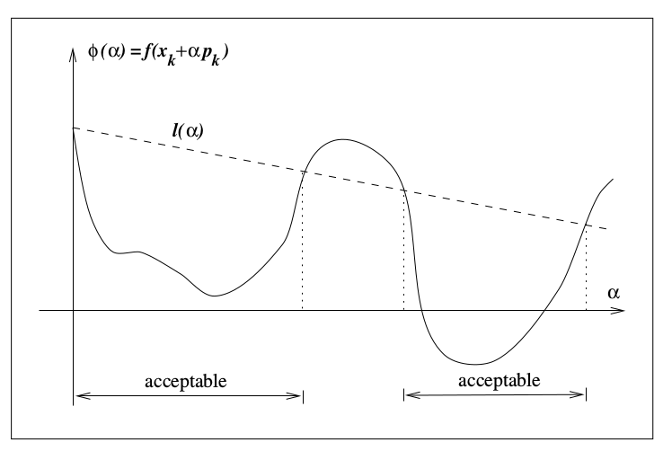
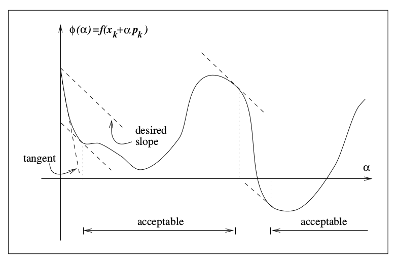
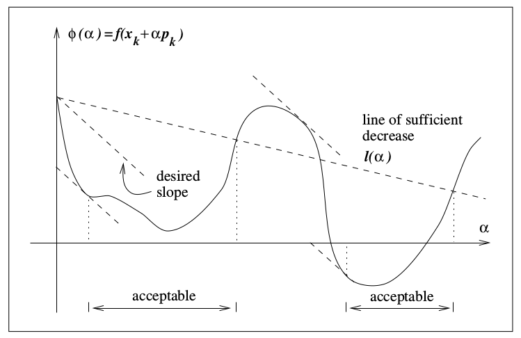
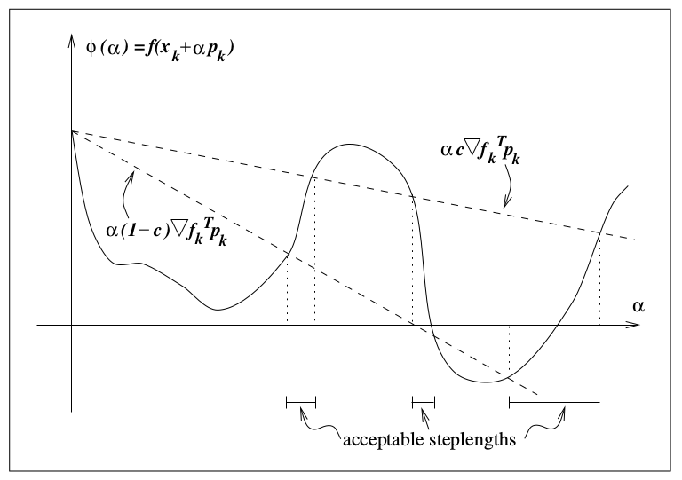
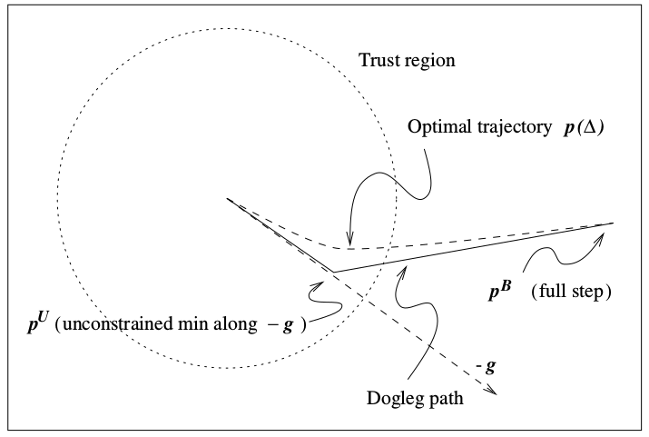

# 1.无约束优化问题

先给定义，问题表示为

$$\min_{x}f(x)\\
where\ x\in\mathbb{R}^n,f:\mathbb{R}^n\rightarrow \mathbb{R}$$

这里我们考虑f是可微的。在找这个问题的解之前先明确什么样的点是该问题的一个解，即什么是极小值点。

- 如果对所有的x都有 $f(\hat x)\leqslant f(x)$，则称 $\hat x$ 为全局极小值点。

- 如果在 $\hat x$ 的邻域 $\mathcal N$ 内有 $f(\hat x)\leqslant f(x),\forall x\in\mathcal N$，则称 $\hat x$ 为局部极小值点。

- 如果 $f(\hat x)<f(x),\forall x\in\mathcal N,x\neq \hat x$，则 $\hat x$ 称为严格局部极小值点。

全局极小值条件比较苛刻，我们先考虑局部较小值。看上去我们需要比较邻域内的所有函数值才能确定一个点是不是局部极小值点，实际上如果函数f是二阶连续可微的，我们可以通过函数梯度 $\nabla f$ 和黑塞矩阵 $\nabla^2f$ 来判定。

$\hat x$ 是局部极小值的条件：

1. 一阶必要条件：$\nabla f(\hat x)=0$
2. 二阶必要条件：$\nabla f(\hat x)=0, \nabla^2f(\hat x)$ 半正定
3. 二阶充分条件：$\nabla f(\hat x)=0, \nabla^2f(\hat x)$ 正定，则 $\hat x$ 是严格极小值点

特别的，如果f是凸函数，则局部极小值就是全局极小值。如果该函数还可微，则导数为0的点就是全局极小值点。

实际情况中凸函数是很少的，对于一般函数我们通过迭代的方法，每次找到一个函数值更小的点，逐步找到最小值，每步迭代的关键就是 如何找到当前点邻域内的极小值点 。根据找邻域内极小值方法的不同，无约束优化方法可分为两类，线搜索和置信域。

$$\left\{
  \begin{matrix}
   线搜索\left\{\begin{matrix}最速梯度下降\\牛顿法\\拟牛顿法\\共轭梯度法\end{matrix} \right.\\
   置信域\left\{\begin{matrix}折线法\\二维搜索\\近似求解\end{matrix} \right.
  \end{matrix}
\right.$$

# 2.方法预览和概述

## 线搜索（line search）

线搜索方法在迭代第k步的目标是

$$\min_{\alpha >0}f(x_k+\alpha p_k)$$

其中需要确定的变量为方向 $p_k$ 和步长 $\alpha$。步长的确定方法我们在后面介绍，先说如何确定搜索方向。最显而易见的搜索方向是负梯度的方向，因为在该方向上函数值的下降速度最快，证明如下：

$$f(x_k+\alpha p)=f(x_k)+\alpha p^T\nabla f_k+\frac{1}{2}\alpha ^2p^T\nabla ^2f(x_k+tp)p,\ for\ some\ t\in(0,\alpha)\tag 1$$

上式为泰勒展开，我们发现函数 f 在某一个方向 p 上的增量等于

$$\left.\frac{\partial f(x_k+\alpha p)}{\partial \alpha} \right| {}_{\alpha=0} = p^T\nabla f_k$$

我们希望找到一个方向p，该方向上函数f下降速度最大，即：

$$\min_{p}p^T\nabla f_k,\ subject\ to\ \|p\|=1$$

因为我们限制了p的模为1，所以上式简化为 $\|\nabla f_k\|\cos\theta$，其中 $\theta$ 为p和梯度之间的夹角。所以当p和梯度反向时，该目标最小，即 $p=-\nabla f_k/\|\nabla f_k\|$ 为函数f下降最快的方向。

**最速梯度下降法** 选择的搜索方向就是负梯度方向，它的计算量很小，但是它是线性收敛的，在接近最优解的地方收敛会很慢。由泰勒分解我们还可以看出，其实只要我们选择的方向和负梯度的夹角小于90度，在步长足够小的情况下都能保证函数f的下降，因为
$$p^T\nabla f_k=\|p\| \|\nabla f_k\|\cos\theta<0, \ \theta\in(\frac{\pi}{2},\frac{3\pi}{2})$$

**牛顿法** 就是选择了一个接近负梯度的方向作为搜索方向，由此获得了更好的收敛速度。怎么做的呢，首先用二次函数近似目标函数：

$$f(x_k+p)\approx f(x_k)+p^T\nabla f_k+\frac{1}{2}p^T\nabla ^2f_kp \overset{def}{=} m_k(p)$$

假设黑塞矩阵正定，目标函数近似为二次函数，二次函数是凸函数，最小值点就是导数等于0的点，所以对上式求导求零点为

$$p_k=-\nabla ^2f_k^{-1}\nabla f_k$$

牛顿方向的可靠性取决于近似函数m和f的相似程度，由于二者相差p的三阶无穷小量，所以在p很小的时候可以认为m对f的近似足够精确。如果黑塞矩阵正定，则可以保证牛顿方向是下降的(在梯度不为0的情况下)：

$$p_k^T\nabla f_k=-p_k^T\nabla ^2f_kp_k<0,\ p_k\neq 0$$

牛顿法的步长一般选择为1，除非经过计算认为该步长上函数f没有下降足够多。

如果黑塞矩阵不正定，则牛顿法会陷入麻烦，因为黑塞矩阵的逆都不一定存在了。这时会有一些修正方法，使搜索方向保持二次收敛特性的同时保证下降性，后面我可能会补充这些方法。牛顿法的优势是二次收敛，劣势是黑塞矩阵求逆计算量大。

**拟牛顿方法** 在每步迭代时估计一个矩阵B代替黑塞矩阵，减小计算量同时获得超线性收敛速度。实际上拟牛顿法根据梯度的变化量来估计黑塞矩阵，这是合理的，我们可以通过对梯度做泰勒展开得到

$$\nabla f_{k+1}=\nabla f_k+\nabla ^2f_k(x_{k+1}-x_k)+o(||x_{k+1}-x_k||)$$

这里我不知道书里是不是用k步的黑塞矩阵近似了k+1步的黑塞矩阵，因为书里得到了下式

$$\nabla ^2f_{k+1}(x_{k+1}-x_k)\approx \nabla f_{k+1}-\nabla f_{k}$$

拟牛顿法最终用B作为H的估计，使其满足

$$B_{k+1}s_k=y_k\\where\ s_k=x_{k+1}-x_k,\ y_k=\nabla f_{k+1}-\nabla f_{k}$$

再由

$$p_k=-B_k^{-1}\nabla f_k$$

确定搜索方向，实现迭代优化。

B还需要满足几个条件：1.是对称矩阵；2. $B_{k+1}$ 和 $B_k$ 之间相差一个低秩矩阵（？）。拟牛顿法一般过程为：给定一个B的初值，然后在前一步B的基础上加一个低秩矩阵（该矩阵由 $s_k,y_k$ 确定）得到新的B。B的更新方法后面随缘介绍。

除了估计H，还有的拟牛顿法直接估计H的逆，这样就连求逆的过程都省了，也是后面随缘介绍。

**共轭梯度法** 获得搜索方向的方法如下

$$p_k=-\nabla f_k+\beta_kp_{k-1}$$

确保了 $p_{k-1}$ 和 $p_{k}$ 是一对共轭的方向（后面再说…），共轭梯度法最早是用来解线性方程组的，而线性方程组 $Ax=b$ 的解也正好是二次函数 $f(x)=\frac{1}{2}x^TAx+b^Tx$ 极小值的解，所以该方法也可以用来做最优化。共轭梯度法和最速梯度下降法有相似的计算复杂度，收敛速度比最速梯度法快，比牛顿法和拟牛顿法慢，不需要保存矩阵。

*所有上述的找搜索方向的方法（除了共轭梯度法）都可以用于置信域方法中。*

## 置信域法（trust-region method）

思路：在迭代第k+1步时，在 $x_k$ 附近用一个函数 $m_k$ 近似函数f，求 $m_k$ 的极小值点 $x_{k+1}$ 作为该次估计的f的极小值点。由于近似只在局部有效，所以我们只在 $x_k$ 的邻域内搜索极小值，也就是置信域内。如果求得的极小值点上f的函数值没有明显下降（m对f的近似不好）则缩小范围，反之可以放大范围。

用数学表达，置信域法将优化问题转化为

$$\min_p m_k(x_k+p),\ where\ x_k+p\ lies\ inside\ the\ trust\ region$$

一般来说p被约束在球中，${\|p\|}_2\leqslant\Delta$， $\Delta$ 称为置信域半径。有时也可以用椭球或方形置信域。一般m会选择二次函数的形式

$$m_k(x_k+p)=f_k+p^T\nabla f_k+\frac{1}{2}p^TB_kp$$

m近似于f的泰勒展开，m和f在x点处的梯度是一样的，B可以是黑塞矩阵或其近似估计。B取不同值时，我们可以得到上述几种线搜索法的形式。

当B取0矩阵时，问题变为：

$$\min_{p}f_k+p^T\nabla f_k,\ subject\ to\ {\|p\|}_2\leqslant\Delta_k$$

解为

$$p_k=-\frac{\Delta_k \nabla f_k}{\|\nabla f_k\|}$$

这其实就是最速梯度法的解。

当B是黑塞矩阵时，我们就得到了置信域牛顿法。此时我们不需要黑塞矩阵正定也能找到极小值，因为我们划定了搜索范围。

当B是黑塞矩阵的估计时，我们就得到了置信域拟牛顿法。

所以，**线搜索（除了共轭梯度法）和置信域法有一些相同点**：都是用 m 来拟合 f，然后寻找 m 的极小值点来近似 f 的极小值点。其中 m 可以选择 f 泰勒展开的前几项作为估计，如果选择二次函数的形式，那么 B 可以选择黑塞矩阵或者其估计。不同点在于：线搜索法是在一个方向上寻找极小值；置信域法是在一个邻域内寻找极小值。

## 尺度

在实际问题中我们优化的自变量向量x，它的各个分量的数值可能相差很大，比如好几个数量级，我们可以选择给x做一个线性变换，得到新变量z，它的各个分量尺度比较相似，这样对z做优化，然后再逆变换得到x。 有一些方法对变量的尺度差比较敏感，比如最速梯度法在此时会收敛更慢，而牛顿法则对尺度差不敏感。

## 收敛速度

定义一下各种收敛速度，后面会提到。

${x_k}$ 是 $R^n$ 上收敛至 $x^{\star}$ 的序列，如果对所有足够大的k，存在常数 $r\in(0,1)$ 满足下式，

$$\frac{\|x_{k+1}-x^{\star}\|}{\|x_k-x^{\star}\|}\leqslant r$$

则称序列是Q-线性（Q-linear）收敛的。其中Q代表除法（quotient）。

如果满足

$$\lim_{k\rightarrow\infty}\frac{\|x_{k+1}-x^{\star}\|}{\|x_k-x^{\star}\|}=0$$

则称为Q-超线性收敛(Q-superlinear)。

如果对所有足够大的k满足

$$\frac{\|x_{k+1}-x^{\star}\|}{\|x_k-x^{\star}\|^2}\leqslant M$$

则称为Q-二次收敛(Q-quadratic)，其中M是常数，不一定要小于1。

# 3.线搜索

这个标题感觉打了无数遍了，终于要来看看到底怎么搜索。线搜索的迭代过程为

$$x_{k+1}=x_k+\alpha_k p_k$$

方向p一般选择为函数值下降的方向，一般有如下形式

$$p_k=-B_k^{-1}\nabla f_k$$

B是对称非奇异矩阵。如果B取单位阵，得到梯度下降法，B取黑塞矩阵H得到牛顿法，B取黑塞矩阵的估计得到拟牛顿法。如果B正定，则可以保证该方向上函数值下降：

$$p_k^T\nabla f_k=-\nabla f_k^TB_k^{-1}\nabla f_k<0$$

## 3.1步长搜索终止条件

我们想在搜索方向上找到最小值，但是又不能把该方向上所有的函数值都算一遍，所以要在计算复杂度和函数值下降之间做一个权衡取舍。大部分线搜索方法会在有限个候选的步长中，找到一个满足预设终止条件的步长。

总的来说分两步：
1. 确定步长所在区间；
2. 用二分法或差值等方法得到一系列候选步长，直到找到满足终止条件的步长。

下面介绍几种终止条件。（这里有很多证明和推导，来证明为什么一定存在满足条件的步长，我看着也不太耐烦，先只几下名字和最后的条件，后面如果有时间有兴趣再补充证明吧。）

- **Armijo condition**

$$f(x+\alpha p)\leqslant f(x)+c_1\alpha \nabla f^Tp,\ c_1\in(0,1)\tag{3.1}$$

一般c1选择的很小，大约 $10^{-4}$ 量级。上图实线表示等式左边，虚线为等式右边。该条件有一个缺点，就是任意足够小的步长都满足该条件。所以我们会添加下面这个条件。

- **curvature condition**

$$\nabla f(x+\alpha p)^Tp\geqslant c_2\nabla f^Tp,\ c_2\in(c_1,1)\tag{3.2}$$

该条件要求步长处的梯度要大于当前点的梯度，即梯度不要那么“负”，如果梯度还很”负“，那么还可以沿着该方向再走一走得到更小的函数值；而如果梯度已经很大，甚至是正数了，那再往下找也不会找到更小的函数值了，可以停止了。牛顿法和拟牛顿法中c2一般取0.9，共轭梯度法一般取0.1。

- **Wolfe conditions**

把上面两个条件合起来就是wolfe condition。

$$\begin{align} f(x+\alpha p) & \leqslant f(x)+c_1\alpha \nabla f^Tp\\
\nabla f(x+\alpha p)^Tp & \geqslant c_2\nabla f^Tp \end{align} \\
where\ 0<c_1<c_2<1$$

对于光滑有下届的函数f，我们总能找到满足wolfe condition的步长，证明略。

- **Goldstein conditions**

$$f(x)+(1-c)\alpha \nabla f^Tp \leqslant f(x+\alpha p)\leqslant f(x)+c\alpha \nabla f^Tp,\ c\in(0,0.5)$$

右边保证了足够下降，左边保证步长不会太小。该条件适合牛顿法，拟牛顿法则不太适合。

- **回溯**

选择一个大于零的初始步长，如1，每次乘以一个小于1的数，直到满足函数值下降的条件。这样可以省掉“防止步长太小”的条件。

## 3.2线搜索方法的收敛性和收敛速度

这里全是推导和证明，我就不写了。记一下结论。关于收敛速度的定义上面写了。

首先它们都能收敛……然后最速梯度法线性收敛，拟牛顿法超线性收敛，牛顿法二次收敛。

还有一种坐标下降法，每次的搜索方向是自变量的其中一个坐标轴，从第一个分量到最后一个分量，再依此循环。该方法不一定收敛，如果收敛的话速度也比最速梯度法慢，但它的计算量很小，而且如果各个分量不耦合的话，它的收敛速度还是可以接受的。

## 3.3步长选择方法

一般选择步长需要迭代的进行，该过程对线搜索优化算法的鲁棒性和效率有很大影响。

[2]中说只使用函数值判断终止条件的线搜索方法效率较低，因为需要迭代几次才能确定一个较小的区间，而同时参考了梯度信息的判据，有可能第一个步长就满足条件，尤其是接近最优解的时候。这段我不是很懂，先转述一下。下面主要介绍使用了梯度信息的方法。

所有线搜索方法首先提供一个步长初值 $\alpha_0$，然后生成候选步长序列 $\{\alpha_i\}$，确定哪个步长满足终止条件，或者确定没有步长满足。整个过程分两步：

1. *回溯过程* 确定步长所在区间
2. *选择过程* 根据前几个步长得到的函数值和梯度，用差值的方法预测下一个步长，不断缩小上述区间，最终确定步长

先讲插值的方法。

### 差值

我们的目的是找到一个有效下降同时不太小的步长，从一个初始步长 $\alpha_0$ 开始，每次通过差值得到一个小于上一个步长 $\alpha_{i-1}$ 但又不太小的 $\alpha_i$。差值会使用到 $\phi$ 的函数值和梯度。

首先把目标函数的函数值写成步长的函数

$$\phi(\alpha)=f(x+\alpha p)$$

则（3.1）可以写成

$$\phi(\alpha_k)\leqslant \phi(0)+c_1\alpha_k \phi'(0)$$

如果初始步长满足上述条件则终止搜索。如果不满足，我们知道合适的步长在区间 $[0,\alpha_0]$ 内。此时构造一个二次函数 $\phi_q(\alpha)$ 来拟合 $\phi$

$$\phi_q(\alpha)=(\frac{\phi(\alpha_0)-\phi(0)-\alpha_0\phi'(0)}{\alpha_0^2})\alpha^2+\phi'(0)\alpha+\phi(0)$$

注意我们构造的方法是使 $\phi_q(0)=\phi(0),\phi_q'(0)=\phi'(0),\phi_q(\alpha_0)=\phi(\alpha_0)$

然后我们求上式的极小值点作为下一个步长 $\alpha_1$。如果该步长满足条件则终止搜索。否则我们构造一个三次函数拟合 $\phi$，使其过 $\phi(0),\phi'(0),\phi(\alpha_0),\phi(\alpha_1)$ 四点。在求其在 $[0,\alpha_1]$ 上的极小值点作为 $\alpha_2$。

如果需要的话这个过程会一直迭代下去，每次用最后的两个步长对应的函数值和 $\phi(0),\phi'(0)$ 四个点差值出三次函数，求其在区间上的极小值点。如果差值得到的步长太接近上一个步长或者0，则直接将其置为 $\alpha_{i-1}/2$。

上述方法是假定 $\phi$ 梯度比较难求的情况下，因为只需要求一个梯度。如果梯度不是很难求，也可以用 $\phi(\alpha_i),\phi'(\alpha_i),\phi(\alpha_{i-1}),\phi'(\alpha_{i-1})$ 四个点拟合。

也可以不用最近的两个步长，而选择其他步长（比如用 $\alpha_{i-1},\alpha_{i+1}$ ）作为拟合点，这取决于我们选择的终止条件。三次函数拟合的方法可以二次收敛到极小值。

### 初始步长

对于牛顿法和拟牛顿法，初始步长一般取1。对于最速梯度和共轭梯度等对变量尺度敏感的方法，可以假设该次迭代应该和上次迭代的函数值下降差不多，即 $\alpha_0\nabla f_k^T p_k=\alpha_{k-1}\nabla f_{k-1}^T p_{k-1}$，则得到

$$\alpha_0=\alpha_{k-1}\frac{\nabla f_{k-1}^T p_{k-1}}{\nabla f_k^T p_k}$$

书中以Wolfe condition为例，介绍了线搜索方法的具体步骤，我就不记了。

# 4.置信域法

和线搜索一样的地方是，都是用二次函数 m 近似目标函数 f。不同点是，置信域法在当前点的邻域内找 m 的极小值点，而不是在固定的方向上找。问题归纳为：

$$\min_{p\in \mathbb R^n}m_k(p)=f_k+\nabla f_k^T p+\frac{1}{2}p^TB_kp\qquad s.t.\ \|p\|\leqslant \Delta_k \tag{4.1}$$

B是对称有上届矩阵。B可以是黑塞矩阵。如果B正定且 $\|B_k^{-1}\nabla f_k\|\leqslant \Delta_k$，则可以直接求出 $p_k^B=-B_k^{-1}\nabla f_k$，这个p我们也称作 full step（我不知道怎么翻译，应该是一步到位的意思）。否则我们要求解一个有二次约束的二次函数最优化问题，这并不容易，好在我们可以用近似解来同时得到较好的收敛速度和计算复杂度。

得到置信域内的极小值点后，我们要判断目标函数f是否得到了有效的下降，用下式来评价

$$\rho_k=\frac{f(x_k)-f(x_k+p_k)}{m_k(0)-m_k(p_k)}$$

分子是实际下降，分母是预测下降(非负)，该比例如果

1. 接近1，则认为m对f的近似较好，下次迭代可以放大置信域范围
2. 在0-1之间，则不修改范围
3. 接近0或者是负数，则m对f的近似不好，拒绝本次更新并缩小范围

这只是简单的逻辑，具体置信域缩放方法还有一些细节。下面简要介绍几种求(4.1)近似解的方法，这是置信域法的重点。

## 4.1比柯西点好一点的解

从线搜索方法我们可以看出，我们不一定要找到搜索方向上真正的最小值点，而是找一个满足某个宽松条件的点就可以实现收敛。置信域法也一样，我们只需要在置信域中找一个下降足够多的点，而不需要真正的极小值点，就可以实现全局收敛。这个下降是否不够多，我们用柯西点来做参考。只要它比柯西点下降的多就可以。

### 柯西点（Cauchy point）

说的挺吓人，柯西点到底是啥。求柯西点的过程如下，先找一个方向满足

$$p_k^s=\arg \min_{p\in \mathbb R^n}f_k+\nabla f_k^Tp \qquad s.t.\ \|p\|\leqslant \Delta_k$$

仔细一看，这个方向就是f的负梯度方向。再找一个步长，满足

$$\tau_k=\arg\min_{\tau>0}=m_k(\tau p_k^s)\qquad s.t.\ \|\tau p_k^s\|\leqslant \Delta_k$$

所以 **柯西点就是在置信域内的梯度方向上的极小值点。**

$$p_k^c=\tau_kp_k^s$$

求解柯西点运算量很小，因为不涉及矩阵分解，只有乘法。同时它提供了可观的函数值下降，实际上只要每次迭代的函数值下降都是柯西点下降量的固定倍数，就可以保证收敛。那么既然每次找到柯西点就能保证收敛了，为什么还要找另一个和柯西点下降差不多的点呢？因为找柯西点的话，就相当于在做置信域范围内的梯度下降，其收敛速度是线性的，而要得到更快的收敛速度，则必须考虑目标函数的二阶导数信息（黑塞矩阵或其估计B）。

很多求（4.1）近似解的方法都是基于柯西点改进的，这些方法在B正定且 $\|B_k^{-1}\nabla f_k\|\leqslant \Delta_k$ 的情况下一般会直接选择full step 作为本次更新。如果不满足这种情况，则会用以下几种方法求近似解。以下我会用 $p^{\star}(\Delta)$ 表示（4.1）的近似解，表示p依赖于置信域大小。

### 折线法（Dogleg method）

我们先看置信域范围对p的取值影响。如果范围很大，则p可以取full step，如果范围很小则m的二次性质可以忽略，则p取负梯度方向，所以随着 $\Delta$ 的变化，p的变化轨迹应该是下图这样的。

其中虚线是（4.1）精确解的轨迹，左边折线是近似负梯度的方向，右边折线右端点是full step位置，用这两段折线近似p的真实轨迹。所以我们可以在这两条折线上找最小值作为（4.1）的近似解。实际上可以证明，m在这条折线上是单调下降的，所以我们只需要求折线和置信域边界的交点就行了。折线部分写成函数形式是

$$\tilde p(\tau)=\left\{
  \begin{matrix}\begin{align}
&\tau p^U,\qquad & 0\leqslant\tau\leqslant 1,\\
& p^U+(\tau -1)(p^B-p^U),& 1\leqslant\tau\leqslant 2.
\end{align}\end{matrix}\right. $$

其中

$$p^U=-\frac{g^Tg}{g^TBg}g$$

以上前提都是B正定，如果B非正定，则需要做一些改进。

### 二维子空间搜索

将搜索限定在二维子空间内，即（4.1）增加一个限制条件

$$\min_{p}m(p)=f+\nabla f^T p+\frac{1}{2}p^TBp\qquad s.t.\ \|p\|\leqslant \Delta,p\in  span[g,B^{-1}g]$$

折线法的折线其实就属于这个二维空间。柯西点也在其中，所以该问题的最优解能保证收敛。如果B非正定要作如下处理，将二维空间修正为

$$span[g,(B+\alpha I)^{-1}g],\qquad for\ some\ \alpha\in(-\lambda_1,-2\lambda_1]$$

$\lambda_1$ 是B最小的特征值，$\alpha$ 的取值需要使 $(B+\alpha I)$ 是正定矩阵。

如果 $\|B+\alpha I\|\leqslant\Delta$ ，则直接取

$$p=-(B+\alpha I)^{-1}g+v$$

其中v满足 $v^T(B+\alpha I)^{-1}g\leqslant 0$。该条件为了保证v使p再“往前走一点”，而不是走回到0（这块没懂为什么要加个v，单纯转述一下）。

如果B有0特征值但是没有负特征值，则直接取柯西点作为最后的解。

### STEIHAUG’S APPROACH

该方法和共轭梯度法的算法一样（没错，用优化方法解另一个优化方法的子问题），区别在于，搜索终止条件为离开置信域范围或者遇到搜索方向是B的负曲率方向（$d^TBd<0$ 的方向d）。因为m是二次函数，上文说过，我们求二次函数的极小值刚好可以用共轭梯度法。具体算法我可能在共轭梯度法中介绍，也可能不写了。

## 4.2求近似精确解

先确定精确解满足什么条件（不证明了……），

向量 $p^\star$ 是（4.1）的全局最优解，当且仅当 $p^\star$ 是可行解，且存在 $\lambda\geqslant 0$ 满足

$$(B+\lambda I)p^\star=-g\tag{4.2a}$$

$$\lambda(\Delta-\|p^\star\|)=0\tag{4.2b}$$

$$(B+\lambda I)\ is\ positive\ semidefinite.\tag{4.2c}$$

看着挺复杂，但都是上面说过的。首先根据（4.2b）分两种情况，如果 $\lambda=0$，则p在置信域内（或边界上），B半正定，$Bp^\star=-g$。如果 $\lambda\neq 0$，则p在置信域边界上，且由（4.2a）得

$$\lambda p^\star=-Bp^\star-g=-\nabla m(p^\star)$$

也就是p的方向刚好是m在p点负梯度的方向。这个可以这样理解，置信域边界应该正好和m的梯度等高线相切于p点。

### 如何求解

当 $\lambda=0$ 时，求解 $Bp^\star=-g$；其他情况，定义

$$p(\lambda)=-(B+\lambda I)^{-1}g$$

然后找一个 $\lambda>0$ 使 $(B+\lambda I)$ 正定，且

$$\|p(\lambda)\|=\Delta$$

这是一个单变量函数，可以用牛顿迭代法求根。具体的细节我先不写了。

还有置信域方法的全局收敛性，emmm，都是证明(T_T)……先算了吧。

# 5.非线性最小二乘

[2]这本书太硬核了，大量证明和实际应用方法，如果深入做的话可以好好看一看，但是我只想科普，先把我觉得重要的东西记下来吧，以后如果有实际应用再来查。[1]会更科普一些，毕竟还有很多篇幅在讲线性规划。为什么我想先写最小二乘，因为我工作中接触残差这类东西比较多，一般优化目标都是残差平方和最小。

最小二乘的目标一般是

$$f(x)=\frac{1}{2}\sum_{j=1}^m r_j^2(x)\tag{5.1}$$

$r_j$ 是 $\mathbb R^n\to \mathbb R$ 的平滑函数，也称之为 *残差（residual）*，本章我们都默认 $m\geqslant n$。

最小二乘在很多领域都有应用，基本上只要是想用一个数学模型拟合数据，就要用最小二乘。通过调整模型参数，使残差平方和最小，就能得到最能拟合实际数据的数学模型。

为什么用最小二乘做目标函数，用其他形式行不行？我们想得到最能拟合实验数据的模型，其实是要求一个极大似然估计，也就是最可能得到这组实验数据的模型，我们实际的目标函数是 $\max P(实验\vert 模型)$。

当我们给定一个模型，我们可以模拟出在没有误差情况下的实验结果，但是因为误差的存在，实际实验结果会和理论结果有偏差，就是 *残差*。此时我们给误差定义一个概率模型，就能求出每个残差出现的概率，将这些概率乘起来就是 *似然*。似然就是残差的函数，进而是模型参数的函数。当我们给误差的模型是 *高斯分布* 的时候，

$$f(x)=\frac{1}{\sqrt{2\pi}\sigma}exp(-\frac{(x-\mu)^2}{2\sigma^2})$$

最大化似然就是最大化

$$\prod exp(-(x_i-\mu)^2)=exp(-\sum r_i^2)$$

就是最小化残差平方和，就是最小二乘。

最小二乘特殊的形式，使其比一般的优化问题要简单一些。首先我们把 $r_i$ 写在一起，写成残差向量的形式

$$r(x)=(r_1(x),r_2(x),...,r_m(x))^T$$

$r:\mathbb R^n\to\mathbb R^m$，则 f 可以写成

$$f(x)=\frac{1}{2}\|r(x)\|^2_2$$

r 的雅各比矩阵为

$$J(x)=\left[\frac{\partial r_j}{\partial x_i}\right]
_{\begin{matrix}j=1,2,...,m\\i=1,2,...,n\end{matrix}}$$

f 的一阶导数和二阶导数就可以表示成 r 的雅各比矩阵的函数。

$$\nabla f(x)=\sum_{j=1}^m r_j(x)\nabla r_j(x)=J(x)^Tr(x)\tag{5.2}$$

$$\nabla^2 f(x)=\sum_{j=1}^m \nabla r_j(x)\nabla r_j(x)^T+\sum_{j=1}^m r_j(x)\nabla ^2r_j(x)\nonumber \\
=J(x)^TJ(x)+\sum_{j=1}^m r_j(x)\nabla ^2r_j(x)\tag{5.3}$$

求得r的雅各比矩阵，就可以计算f的梯度，而且可以计算f黑塞矩阵的第一项。实际上因为模型在最优解附近是近似线性的，且残差一般很小，我们常常可以忽略第二项，很多算法就用第一项来近似黑塞矩阵，这样计算量非常小。

## 5.1线性最小二乘

线性最小二乘形式为

$$f(x)=\frac{1}{2}\|Jx+r\|^2_2\tag{5.4}$$

其中 $r=r(0)$，则

$$\nabla f(x)=J^T(Jx+r),\nabla ^2 f=J^TJ$$

f是凸函数，所以极小值点必须满足 $\nabla f=0$，由此得到

$$J^TJx^{\star}=-J^Tr\tag{5.5}$$

该式称为（5.4）的正规方程（normal equations)。求解该方程有几种方法，第一种用cholesky分解。cholesky分解在 $m\geqslant n,Rank(J)=n$ 的情况下一定存在。缺点是 $J^TJ$ 的条件数可能很大，导致解不稳定。

第二种方法用QR分解。

$$J\Pi=Q\left[\begin{matrix}R\\0\end{matrix}\right]=\left[\begin{matrix}Q_1&Q_2\end{matrix}\right]\left[\begin{matrix}R\\0\end{matrix}\right]=Q_1R$$

其中 $\Pi$ 是置换矩阵。单位正交阵不会改变一个向量的模长，所以

$$\begin{align}\|Jx+r\|^2_2&=\|Q^T(Jx+r)\|^2_2 \\
 &=\left\|\left[\begin{matrix}Q_1^T\\Q_2^T\end{matrix}\right] (J\Pi\Pi^Tx+r)\right\|^2_2\\
&=\|R(\Pi^Tx)+Q_1^Tr\|^2_2+\|Q_2^Tr\|^2_2 \end{align}$$

对其求导使倒数为零，得到

$$x^{\star}=-\Pi R^{-1}Q_1^Tr$$

该方法不依赖 $J^TJ$ 的条件数，而是对 $J$ 的条件数比较敏感，使得这种方法更稳定一点。

当我们想知道解在J和r存在扰动的情况下会受到多大影响时，就要使用第三种方法，奇异值分解。

$$J=U\left[\begin{matrix}S\\0\end{matrix}\right]V^T=\left[\begin{matrix}U_1&U_2\end{matrix}\right]\left[\begin{matrix}S\\0\end{matrix}\right]V^T=U_1SV^T$$

$$\begin{align}\|Jx+r\|^2_2&=\left\|\left[\begin{matrix}S\\0\end{matrix}\right] (V^Tx)+\left[\begin{matrix}U_1^T\\U_2^T\end{matrix}\right]r \right\|^2_2 \end{align}$$

使一阶导数等于0，得到

$$x^{\star}=VS^{-1}U_1^Tr=\sum^n_{i=1}\frac{u_i^Tr}{\sigma_i}v_i$$

其中 $u_i,v_i$ 分别为U，V的列向量。当 $\sigma_i$ 很小时，x对 r 和 J 的扰动就会很敏感。在J接近秩亏的时候，这些信息就会十分有用，如果有些 $\sigma_i$ 很小，我们在求和时就略去这些项。

综上所述，在 $m\gg n$ 时用cholesky分解就够了，QR分解对J的条件数要求更低一点，而SVD分解则可以处理 J 秩亏的情况。

## 5.2非线性最小二乘

### 高斯牛顿法（Gauss-Newton method）

高斯牛顿法是改进的牛顿线搜索法，它不求解标准牛顿法中的 $\nabla ^2 fp=-\nabla f$，而是忽略了黑塞矩阵的第二项，求解

$$J^TJp^{GN}=-Jr\tag{5.6}$$

这种近似有很多好处。

1. $\nabla^2 f\approx J^TJ$ 节省很多计算量；
2. 虽然忽略了黑塞矩阵的第二项，但是高斯牛顿法依然有和牛顿法接近的收敛速度，因为在两种情况下第二项比第一项小得多：（1）残差很小；（2）残差函数r接近线性。实际应用中很多最小二乘问题满足残差小的条件；
3. 在J满秩且f的梯度非零时，高斯牛顿法得到的p总是一个下降方向；
4. 我们注意到（5.6）和（5.5）的形式一样，所以我们可以用上一节介绍的方法求解（5.6）。从另一个方面想，高斯牛顿法没有用二次函数拟合f，而是用线性函数拟合r， $f(x)=\frac{1}{2}\|r(x)\|^2_2=\frac{1}{2}\|r(x)+J(x)p\|^2_2$，求使 f 最小的p。

书中经过一顿推导，得到高斯牛顿法的收敛性质。如果J的特征值有正的下届，则收敛速度为线性或超线性，当f的黑塞矩阵为0时，可达到二次收敛。

### LM算法（LEVENBERG–MARQUARDT method）

LM算法是置信域法的前身，置信域法可以处理J秩亏的情况，它同样忽略了黑塞矩阵的第二项，所以和高斯牛顿法有相似的收敛速度。问题表示为

$$\min_p\frac{1}{2}\|Jx+r\|^2_2,\qquad subject\ to\ \|p\|\leqslant \Delta\tag{5.7}$$

$$m(p)=\frac{1}{2}\|r\|^2+p^TJ^Tr+\frac{1}{2}p^TJ^TJp$$

问题（5.7）可以分两种情况，如果问题的高斯牛顿解在置信域内，则该解也是LM解；如果不在置信域内，则解满足

$$(J^TJ+\lambda I)p=-Jr,\lambda > 0,\|p\|=\Delta$$

上式和第四章的（4.2）形式一样，可以用同样的方法证明。注意上式是下面这个线性最小二乘问题的正规方程

$$\min_p\frac{1}{2}\left\|\left[\begin{matrix}J\\\sqrt{\lambda}I\end{matrix}\right]p+\left[\begin{matrix}r\\0\end{matrix}\right]\right\|^2_2$$

又可以用上一节的方法求解了。注意这里因为 $J^TJ$ 是半正定的，所以 $(J^TJ+\lambda I)$ 一定是正定的，一定可以用QR分解求解。

LM算法在一开始提出来的时候并没有提置信域的概念，它直接根据f的下降程度缩放 $\lambda$。后来才有人把它和置信域联系起来。

LM算法的收敛性质和高斯牛顿法差不多，因为他们选的模型是一样的，在靠近最优解的时候，因为满足残差很小的条件，模型拟合会比较精确，所以基本上每次迭代都是高斯牛顿法的解。
